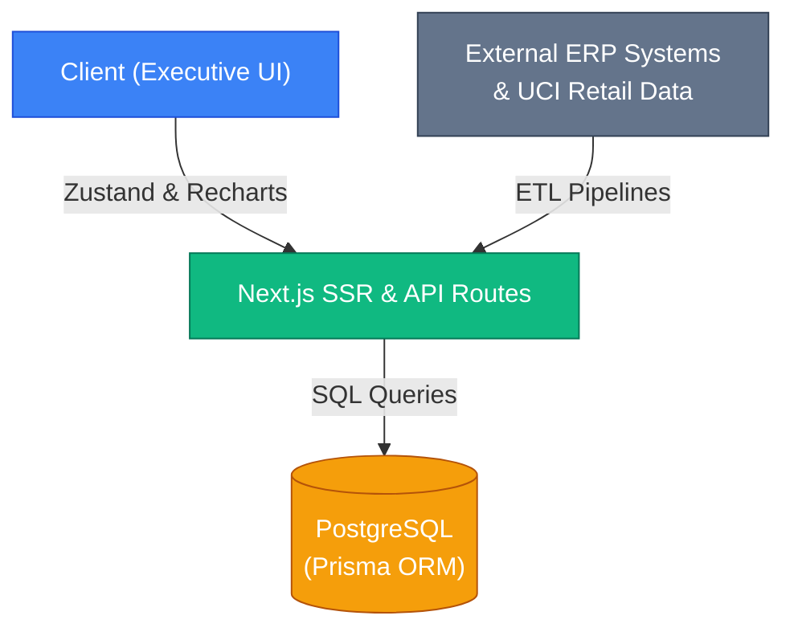
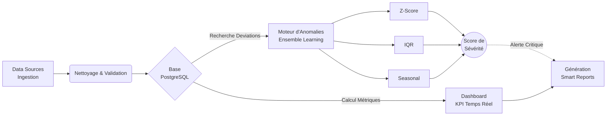
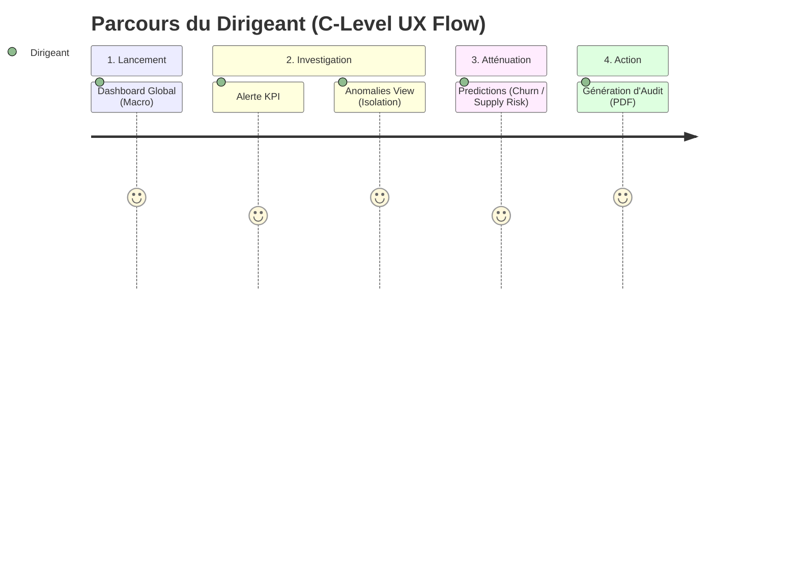
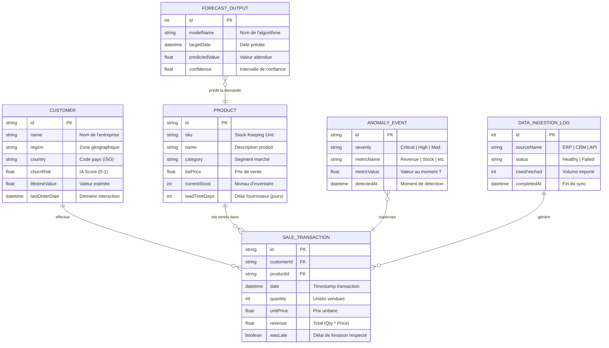

# 🧠 Architecture et Flux d'Activité : Nexus Analytics Platform

Ce document détaille le flux d'activité end-to-end, les processus d'analyse en temps réel, et la stack technique de la **Nexus Analytics Platform** — une plateforme d'analyse prédictive d'entreprise de classe mondiale basée sur le jeu de données *UCI Online Retail*.

---

## 🏗️ 1. Architecture Globale et Outils (Tech Stack)

En tant que plateforme "Advanced", Nexus repose sur une architecture moderne, performante et hautement modulaire.

- **Frontend & Framework Cœur** : [Next.js 16 (App Router)](https://nextjs.org/) offrant un rendu hybride (SSR / Client) pour des temps de chargement ultra-rapides.
- **Langage** : [TypeScript 5](https://www.typescriptlang.org/) garantissant la sécurité des types et une excellente robustesse du code.
- **Styling & UI** : [Tailwind CSS 4](https://tailwindcss.com/) couplé à [Radix UI](https://www.radix-ui.com/) pour des composants accessibles et un design en "Glassmorphism" premium.
- **Data Visualization** : [Recharts](https://recharts.org/) pour générer des graphiques interactifs en SVG avec animations fluides capables d'absorber de grands volumes de données.
- **State Management** : [Zustand](https://zustand-demo.pmnd.rs/) (`useAppStore`) gère de manière centralisée le routage interne et l'état global de l'interface sans la lourdeur de Redux.
- **Backend & Base de Données** : Serveur d'API interne Next.js interfaçant de manière transparente avec **PostgreSQL** via l'ORM **Prisma**. Les flux incluent des mécanismes de fallback (résilience) garantissant le fonctionnement de l'UI même en cas de rupture de la base de données.

---

## 🔄 2. Flux d'Activité (Activity Flow)

Le cycle de vie de la donnée au sein de Nexus est divisé en **4 phases distinctes**.

### Phase A : Ingestion des Flux de Données (ETL)
*Module concerné : Data Sources*
- La plateforme se connecte à des bases de données disparates et des systèmes ERP.
- **Nettoyage et Transformation** : L'ingestion normalise les devises, valide le formatage de la base *UCI Online Retail* (approx. 541 000 transactions) et élimine les adresses IP frauduleuses ou les commandes annulées.
- **Synchronisation** : Les pipelines de streaming s'actualisent et signalent leur état en temps réel via l'interface (ex: statut "Healthy", "Running").

### Phase B : Modélisation et KPI en Temps Réel (Dashboarding)
*Module concerné : Dashboard View*
- Les données nettoyées alimentent le "Executive Dashboard".
- Les dirigeants peuvent avoir une vue macro du Chiffre d'Affaires Global (YTD), des ventes régionales (ex : Royaume-Uni vs France vs Allemagne), et du coût d'acquisition.
- Des micro-tendances (croissance ou perte) sont calculées chaque jour et affichées pour guider les décisions à court terme.

### Phase C : Détection d'Anomalies (Ensemble Learning)
*Module concerné : Anomalies View*
- Le moteur asynchrone fait passer les métriques de l'entreprise par **5 détecteurs statistiques isolés** fonctionnant en parallèle :
  1. **Z-Score** : Cible les déviations statistiques brutes.
  2. **IQR (Interquartile Range)** : Isole les outliers par rapport à la médiane.
  3. **Percentile** : Analyse les "queues" extrêmes de la courbe.
  4. **Moving Avg** : Suivi des cassures sur 7/14/30 jours.
  5. **Seasonal** : Compare la charge actuelle aux tendances de l'année 2025.
- Lorsqu'une anomalie est confirmée (par ex. *Unseasonal early stock depletion for JUMBO BAG RED RETROSPOT*), elle reçoit un score de sévérité (Critical, High, Medium, Low) et déclenche une alerte UI.

### Phase D : Prévisions et Audits (Insights)
*Modules concernés : Predictions View & Smart Reports*
- **Supply Chain Risk** : Nexus évalue les transporteurs et distributeurs, attribuant des scores de risques (0.0 à 10.0) selon la latence logistique, le taux de retard (Delay Rate) et le score de qualité (Quality Score).
- **Churn Prediction** : L'IA évalue les probabilités d'attrition client selon leur fréquence d'achat et la décence de leur dernier panier.
- **Rapports Intelligents** : Le système compacte l'historique et les résolutions des anomalies pour générer des rapports contextuels mensuels et hebdomadaires avec des recommandations actionnables (« Augmenter le stock avant les fêtes », « Changer de transporteur sur la région PACA », etc.).

---

## 🎯 3. L'Expérience Utilisateur (UX Flow)

L'UI a été pensée spécifiquement pour le *Executive Management* (C-Level).
1. **Lancement** : L'utilisateur arrive sur le Dashboard global (Vue Macro).
2. **Investigation** : En cas de baisse de KPI, il navigue vers **Anomalies** pour isoler la métrique fautive.
3. **Atténuation** : Il consulte l'onglet **Predictions & Risk** pour identifier si le problème vient de la chaine logistique (Supply Chain) ou d'une perte de segment d'utilisateurs (Churn).
4. **Action** : Via le gestionnaire de **Smart Reports**, il peut générer un audit formel (PDF/Export) expliquant les actions correctives à son équipe.

> **Note d'ingénierie** : Chaque page est asynchrone et protégée par un `Loader` personnalisé, et la structure *Glassmorphic* garantit que le focus cognitif de l'utilisateur reste strictement sur la data et les variations des indicateurs de performance.

---

## 📊 4. Diagramme d'Entité-Relation (Technical ER Diagram)

Ce diagramme illustre la structure des données et les relations entre les entités métier (Customers, Products, Transactions) et les entités de monitoring IA (Anomalies, Forecasts).

### Détails Techniques Supplémentaires
- **Indexation** : Les champs `date`, `region`, et `churnRisk` sont indexés circulairement pour garantir des requêtes analytiques en moins de 100ms.
- **Normalisation** : Les données sources (CSV/API) sont normalisées en 3NF (Troisième Forme Normale) avant d'être injectées dans le schéma `SaleTransaction`.
- **IA Metadata** : Les modèles de prévision stockent un `featuresSnapshot` (JSON) pour permettre l'auditabilité des décisions de l'IA (Explainable AI - XAI).

